Introduction
============

Feature extraction turned out to be the deciding step in the results of sentiment analysis, as a result of this fact our work was mainly focused on trying different feature extraction techniques, specifically we tried three different methods to represent a document: TF-IDF sparse vectors, doc2vec and word vectors weighted with TF-IDFs.In the following sections we discuss how we went about using each of these methods, following this we would discuss our usage of different classifiers.

Preprocessing
=============

Tokenization
------------

We used some regular expressions to remove punctuation followed by a simple call to split to split the words into tokens.

Lemmatiztion
------------

We used the nltk wordnet lemmatizer since after some researching we came up to the conclusion that lemmatization results in better accuracies than stemming since it considers the word’s context insteda of merely stripping of the suffix as stemming does.

Removing Stop Words
-------------------

We used nltk’s stop words list to remove stop words from the corpus.

What we have so far
-------------------

After doing the above cleaning steps, we got the following word clouds for positive and negative documents , from inspecting those figures we noticed that some of the there are words that appeared very frequently in both classes that they contributed no meaning to the classifier, so we tried removing the 50 most frequent words in both classes after taking the intersection of the frequency dictionaries of both classes,as could be seen in the figures, much of the noise has been removed, and the type of words in both classes started to give some indication of the sentiment, increasing the number of words we removed increased made things clearer, however it also decreased the size of the corpus drastically which had negative effects on accuracy, which is discussed later when we speak about how we classified the data.

Part of Speech Tagging 
-----------------------

As another preprocessing step, we appended the part of speech tags to their corresponding words and treated the resulting compound words as our vocabulary, we only tried this approach with the word2vec model.

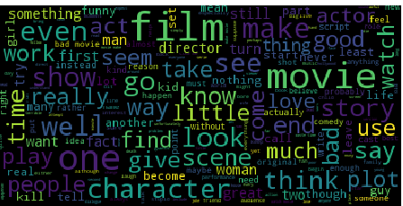

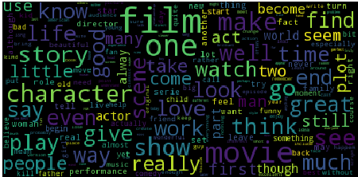 

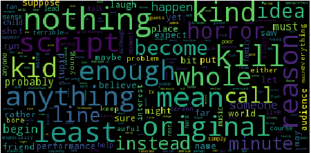

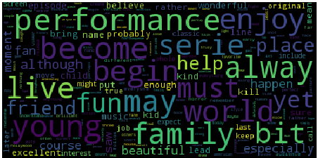 

Feature extraction
==================

TF-IDF sparse vectors
---------------------

### Overview

It’s firstly built on tokenization, text preprocessing and filtering of stopwords with the use of countvectorizer function that is able to build a dictionary of features and transform documents to feature vectors. The index value of a word in the vocabulary is linked to its frequency in the whole training corpus. We then transform the occurrences to frequencies. Occurrence count is a good start but there is an issue: longer documents will have higher average count values than shorter documents, even though they might talk about the same topics. To avoid these potential discrepancies it suffices to divide the number of occurrences of each word in a document by the total number of words in the document: these new features are called tf for Term Frequencies. Another refinement on top of tf is to downscale weights for words that occur in many documents in the corpus and are therefore less informative than those that occur only in a smaller portion of the corpus. This downscaling is called tf–idf for “Term Frequency times Inverse Document Frequency”. and here we used the skikit-learn function called “TfidfTransformer”.

Word vectors weighted with TF-IDFs
----------------------------------

### Overview

This representation mainly relies on building word vectors for each word in the corpus-a word vector is nothing but a way to represent a word as a point in some high dimensional space, those vectors are then used to convert each document into a matrix of constant length vectors, since this matrix has a different length for each document we couldn’t just stretch the matrix into one long vector and use it as the input to the classifiers, so after some researching we found out that the best results in literature was obtained with a weighted average of the rows of the matrix using the TF-IDF (described in the previous section) of the word represented by the vector as the weight.

### Word2Vec

The exact method we used to produce the word vectors was the word2vec model, to be specific we used the implementation provided by the gensim library.This model has 2 variants the continuous bag of words or CBOW for short and the skip-gram model, at the core of those two lies a 2 layer neural network that receives as input a binary vector with a one in the position of the word or words we want to input. As for the output of the network, this is what differentiates the two variants, as for CBOW it takes as input a window of words and learns a function that predicts the next word following the window-the output is a vector of probabilities that has the length of the vocabulary.The skip-gram model differs from the other variant in that it tries to predict the probability that a word in the vocabulary appears in the window centered at the input word to the network.The network also uses a softmax layer for scoring.After the network is trained the hidden layer wights are considered our word vectors, Figure [fig:word2vec] shows a subset of the word vectors projected into 2 dimensions using PCA, the proximity of points should indicate how close they are in meaning for example bananas and apples should have very close vectors- the network extracts this from the context of the words in the corpus, however due to the relatively small size of our corpus the vectors aren’t very accurate.

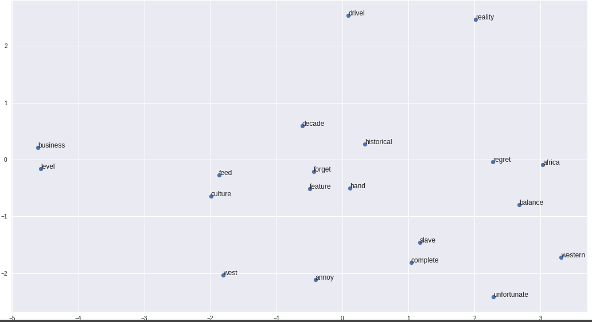 [fig:word2vec]

Doc2vec
-------

### Overview

Doc2Vec is to create a numeric representation of a document, regardless of it’s length. But unlike words, documents do not come in logical structures such as words. The concept used is simple,use word2vec model, and added another feature vector (document-unique). So, when training the word vectors W, the document vector D is trained as well, and in the end of training, it holds a numeric representation of the document.

### Combined Doc2Vec

There are several algorithm used in doc2vec, one is Distributed Memory version of Paragraph Vector (PV-DM). It acts as a memory that remembers topic of the paragraph. While the word vectors represent the concept of a word, the document vector intends to represent the concept of a document. Another algorithm which is similar to skip-gram may be used, Distributed Bag of Words version of Paragraph Vector (PV-DBOW). The authers of an article using Doc2Vec recommend using a combination of both algorithms.

Classifiers Choice
==================

TF-IDF Model
------------

### Overview

Now that we have our features, we can train a classifier to try to predict the positivity of a review. for all the previous three steps we used pipeline. In order to make the vectorizer transformer classifier easier to work with, scikit-learn provides a Pipeline class that behaves like a compound classifier so we used it as a one shot excutioner. Below you will find an example of how to implement a piepline class.

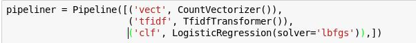 [fig:tf-idf]

### Hyperparameter Tuning and crossvalidating the training data

Hyper-parameters are parameters that are not directly learnt within estimators. We will use a great technique to get the best estimator with the best parameters which is also in the scikit-learn library. A search consists of:

-   an estimator (regressor or classifier such as sklearn.svm.SVC())

-   a parameter space

-   a method for searching or sampling candidates

-   a cross-validation scheme and

-   a score function.

### Our group of classifiers:

-   Multinomial Naive Bayes Classifier

    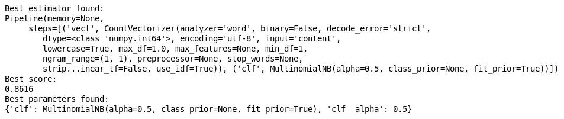 [fig:nb]

-   Adaboost

    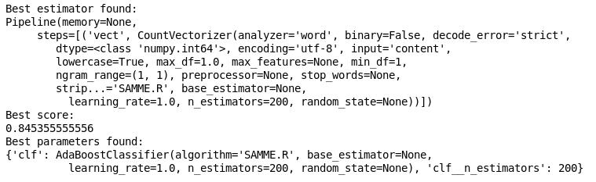 [fig:adaboost]

-   Random forest

    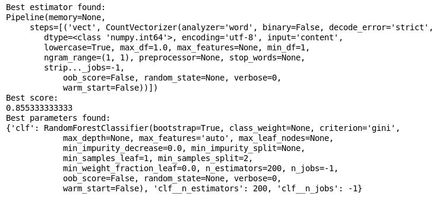 [fig:randomforest]

-   Decision Tree Classifier

    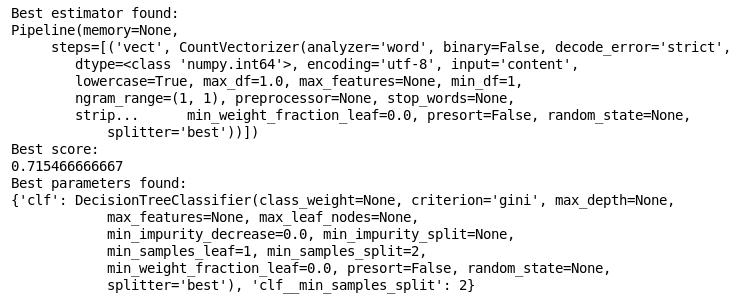 [fig:tree]

-   Logistic Regression Classifier

    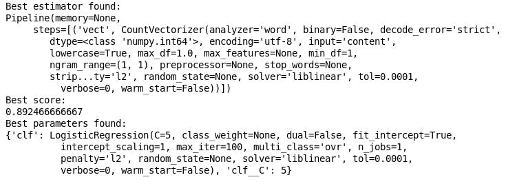 [fig:logistic]

Word2Vec Model
--------------

### Overview

As previously stated, we have tried three different preprocessing techniques with this feature extraction method, namely: just basic cleaning, appending POS tags and removing words appearing with high frequency in both positive and negative classes.We tuned six classifiers on each of the 3 preprocessed data sets, we used 10-fold cross validation to search with Logistic Regression and only used used one fold of size 10% with the rest of the classifiers due to their demand for resources which we couldn’t afford.In what follows we briefly discuss the accuracies we got with each method.

### Basic Cleaning

Figure [fig:word2vecrbf] shows that the best accuracy achieved on the validation set is just above 77%, this accuracy however dropped by one percent to 76.6 on the test data.This was the best performing classifier, the rest of the classifiers and their validation set performance is in the accompanying jupyter notebook.

### Part of speech tagging

The SVM with a RBF kernel achieved the best accuracy when using this method as well which was also just above 77% as shown in Figure [fig:word2vecrbfpos] which isn’t much of an improvement over the basic cleaning method.

### Removal of noisy words

This was our last try to improve the accuracy of this method, however we didn’t seem to get any improvement either as the accuracy dropped by 0.5% with the SVM as Figure [word2vecrbffreq] shows.

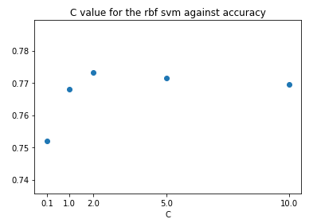 [fig:word2vecrbf]

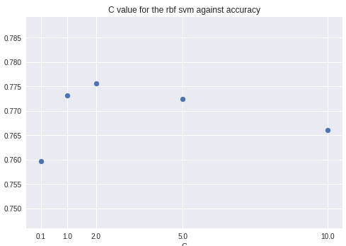 [fig:word2vecrbfpos]

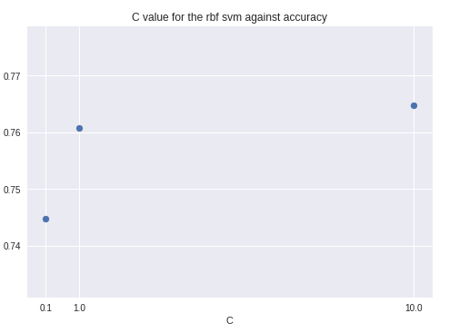 [fig:word2vecrbffreq]

Doc2Vec Model
-------------

Conclusion
==========
